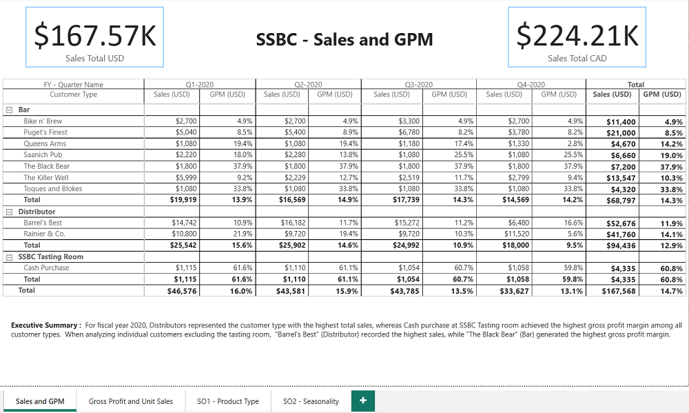
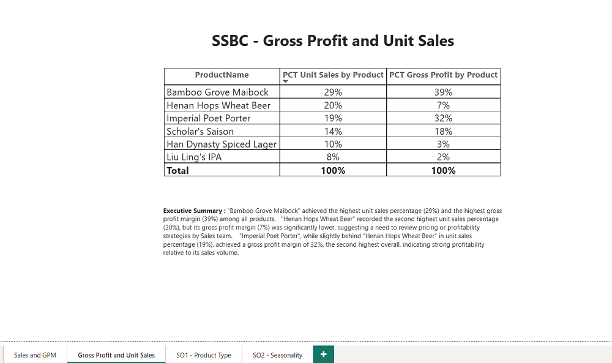
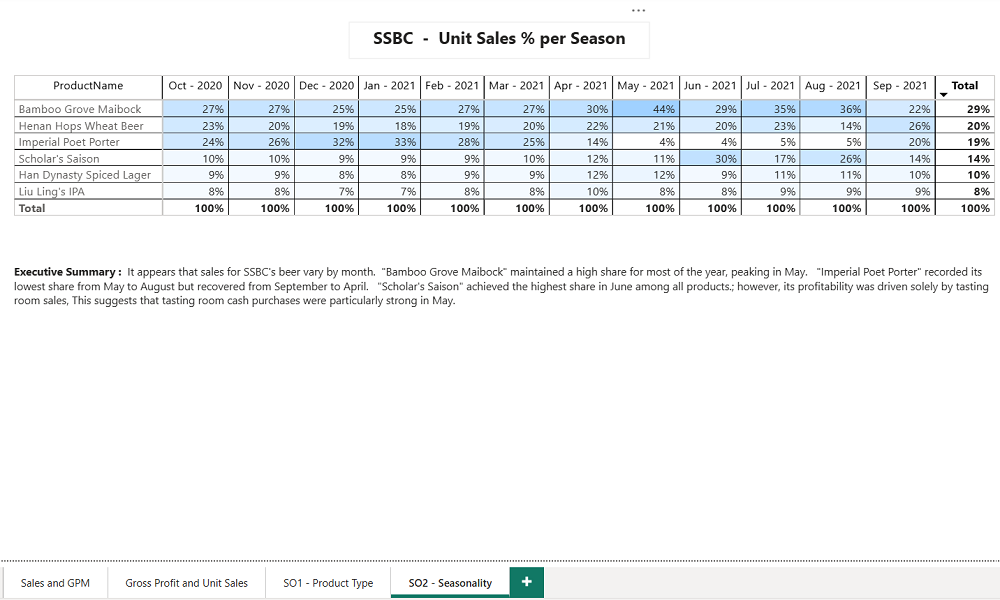

# Project 1: Data Modeling and Reporting for Seven Sages Brewing Company

## Objective

Develop a comprehensive data model and interactive Power BI dashboard for **Seven Sages Brewing Company**. The goal is to consolidate data from multiple sources across the business to help the CFO identify top-selling beers and analyze product profitability effectively.

---

## Project Overview

This project follows a structured approach to data transformation, modeling, and visualization using Power BI. The final deliverables include a clean, relational data model and visuals that support meaningful business insights.

---

## Key Tasks

### 1. Data Preparation with Power Query

- Import and shape raw datasets into structured tables.
- Clean and format the data to suit modeling requirements.
- Generate a **date table** with fiscal year support for accurate time-based analysis.

### 2. Data Modeling

- Define and establish relationships between data tables to support filtering and aggregation logGic.

### 3. DAX Measures and Visualizations

- Create DAX measures that meet business and reporting needs.
- Build basic visuals (table, matrix, card) to validate model structure and logic.
- Use visuals to test measure calculations and confirm model accuracy.

### 4. (Optional) Product Type Profitability Analysis

- Develop a matrix showing profitability per serving by product type (e.g., keg, six-pack).
- Create a DAX measure called **Servings Sold** to standardize beer sales data across formats.

---

### Dashboard Preview

I have built four pages for this report. The format was provided.

🟠 1. Sales and GPM

🟢 2. Gross Proft and Unit Sales

🟣 3. SO1 Product type

🔴 4. SO2 Seasonality

